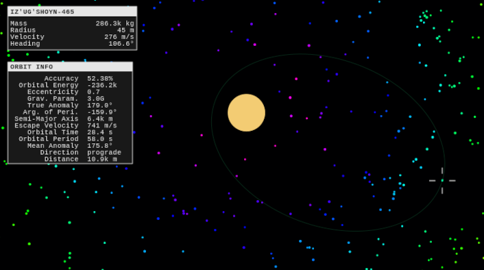
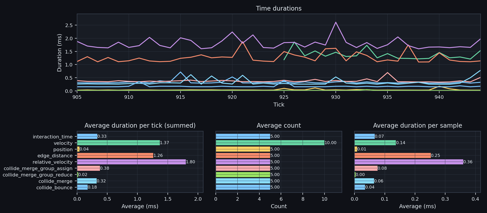

# Orbital Engineer

An N-body orbital engine that implements a Leapfrog KDK integrator. Supports body merging or
collision bouncing.



## Theory of Operation

Fundamentally, the engine is split into a pipeline of several OpenCL kernels. The controller is
executed on the host, and is responsible for initialization and kernel dispatching. The simulation
is performed tick-by-tick, using [leapfrog KDK integration](https://en.wikipedia.org/wiki/Leapfrog_integration)
in order to continually compute orbital state vectors for velocity and position.

The tick receives the amount of real time that has passed since the last tick. If the dt is greater than
the default `dt_base` (set by config option `DEFAULT_DT_BASE`), it will split the operation into several
time steps (each using the value of `dt_base`).

Each time step is broken down into three phases:

 1. **Swept detection** - Compute the time-of-impact for each pair of bodies and track the minimum dt.
    If the minimum dt is smaller than the base dt for the tick, it is used as the input dt for
    future steps.
    - By ensuring the dt is never larger than the earliest collision, the engine avoids
    having a body overlap or 'tunnel' through another body.
    - Two bodies are considered to be in-contact when their edge-to-edge distance is less than
      the config value `EPS_DIST`.

 2. **Leapfrog KDK** - Integrate position and velocity via three steps:

    |   | step       | dt input       | updates vector    |
    | - | ---------- | -------------- | ----------------- |
    | 1 | `KICK`     | $\frac{dt}{2}$ | velocity          |
    | 2 | `DRIFT`    | $dt$           | position          |
    | 3 | `KICK`     | $\frac{dt}{2}$ | velocity          |

    During kick operations, position vector is read-only.
    And during drift operations, velocity vector is read-only.

 3. **Collision Detection** - Determine which bodies are touching, and apply collision operations.
    Based on the per-body feature flags, one of the following strategies will be enacted.

    - **_None_** : Bodies pass through each-other. In order to avoid asymptotes, overlapping bodies
      do not continue to impart force until they are no longer overlapping. This is the default
      strategy for bodies that do not have a `MERGE` or `BOUNCE` flag.
    - **_Merge_** : Bodies are combined. Their velocities and positions are computed based on
      their center-of-mass.
    - **_Bounce_** : Bodies deflect off of eachother. The strength is controlled by the
      [coefficient of restitution](https://en.wikipedia.org/wiki/Coefficient_of_restitution).
      Set via the config option, `COEF_OF_RESTITUTION`.

## Development

 1. Install system-level OpenCL requirements
    - For AMD GPUs: `sudo pacman -Syu rocm-opencl-runtime`
 2. Set up the virtualenv: `make venv`
 3. Install the engine: `pip install -e .`

## Analyzing Metrics



There's a companion app in `src/ui_metrics` that will display kernel runtime durations.

It can be started via:

   ```shell
   ./.venv/bin/python src/ui_metrics/metrics_app.py
   ```

In the main app, metrics are controlled via:

   orbitalengineer.engine.config.EMIT_METRICS

When set to `True` (default), pyopencl will enable profiling (which may slightly affect kernel
speed), and the orbital-engine will emit the kernel metrics to the socket specified
by `METRIC_SOCKET_PATH`.
