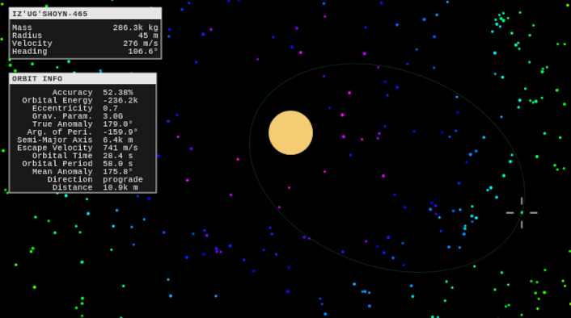
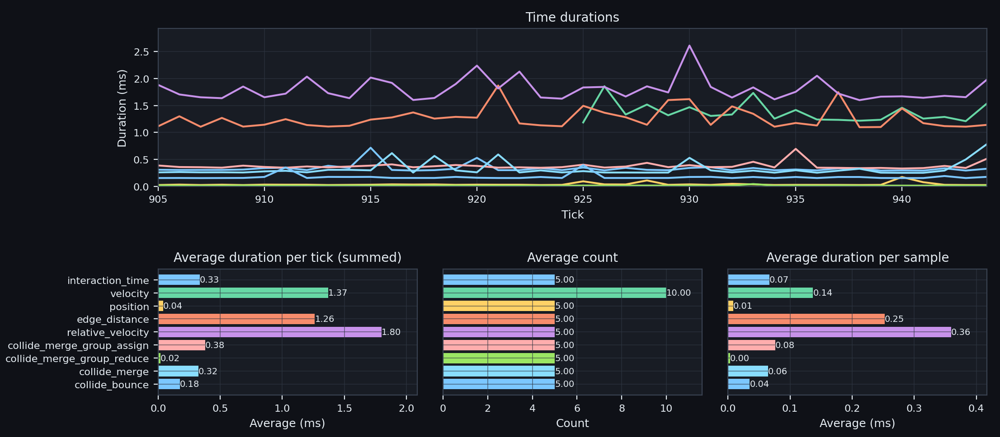

# Orbital Engineer

An N-body orbital engine that implements a Leapfrog KDK integrator. Supports body merging or collision bouncing.

## Theory of Operation

Fundamentally, the engine is split into a pipeline of several OpenCL kernels. The controller is executed on the host, and is responsible for initialization and kernel dispatching. The simulation is performed tick-by-tick, using [leapfrog KDK integration](https://en.wikipedia.org/wiki/Leapfrog_integration) in order to continually compute orbital state vectors for velocity and position.

### Clock Tick

The tick receives the amount of real time that has passed since the last tick. If the dt is greater than the default `dt_base` (set by config option `DEFAULT_DT_BASE`), it will split the operation into several time steps (each using the value of `dt_base`).

### Time Step

Each time step is broken down into three phases:

 1. **Swept Detection** - Compute the time-of-impact for each pair of bodies and track the minimum dt. If the minimum dt is smaller than the base dt for the tick, it is used as the input dt for future steps.
    - By ensuring the dt is never larger than the earliest collision, the engine avoids having a body overlap or 'tunnel' through another body.
    - Two bodies are considered to be in-contact when their edge-to-edge distance is less than the config value `EPS_DIST`.

 2. **Leapfrog KDK** - Integrate position and velocity via three steps:

    |   | step       | dt input       | updates vector    |
    | - | ---------- | -------------- | ----------------- |
    | 1 | `KICK`     | $\frac{dt}{2}$ | velocity          |
    | 2 | `DRIFT`    | $dt$           | position          |
    | 3 | `KICK`     | $\frac{dt}{2}$ | velocity          |

    During kick operations, position vector is read-only.
    And during drift operations, velocity vector is read-only.

 3. **Collision Detection** - Determine which bodies are touching, and apply collision operations. Based on the per-body feature flags, one of the following strategies will be enacted.

    - **_None_** : Bodies pass through each-other. In order to avoid asymptotes, overlapping bodies do not continue to impart force until they are no longer overlapping. This is the default strategy for bodies that do not have a `MERGE` or `BOUNCE` flag.
    - **_Merge_** : Bodies are combined. Their velocities and positions are computed based on their center-of-mass.
    - **_Bounce_** : Bodies deflect off of eachother. The strength is controlled by the [coefficient of restitution](https://en.wikipedia.org/wiki/Coefficient_of_restitution). Set via the config option, `COEF_OF_RESTITUTION`.

## Apps

### Orbital Engineer Server

The core app that manages the n-body engine. It is responsible for:

- taking in commands via a socket connection from client apps
- dispatching ticks/steps to the kernels (either OpenCL or NumPy)
- syncing orbital state vectors from GPU memory to shared memory
- Tracking & writing kernel metrics to an IPC socket

It will not do anything "on its own" and needs a client to direct it.

### User Interface Client App

Companion app to the server. It builds scenarios, sends commands, and constructs the display based on the orbital state vectors within shared memory.

### App Interactions

    ┏━━━━━━━━━┓     ╭───────────╮                        ╭───────╮
    ┃         ┃     │           ├──── OpenCL kernels ────│  GPU  │
    ┃ SERVER  ┃     │ ORBITAL   │                        ╰───────╯
    ┃         ┃     │ ENGINEER  │
    ┃         ┃     │ (library) │                        ╭───────╮
    ┃         ┃┄┄┄┄┄│           ├──── NumPy kernels ─────│  CPU  │
    ┃         ┃     ╰───────────╯                        ╰───────╯
    ┃         ┃
    ┃         ┃
    ┃         ┃                                  ╭───────────────╮
    ┃         ┃──── write state vectors ───────>>│               │
    ┗━━━━━━━━━┛                                  │ SHARED MEMORY │
         │                                       │               │
         │                                       │ - position    │
     IPC socket                                  │ - velocity    │
     connection                                  │ - mass        │
         │                                       │ - radius      │
         │                                       │ - flags       │
    ┏━━━━━━━━━┓                                  │ - force (N,N) │
    ┃         ┃<<─── read state vectors ─────────│               │
    ┃   GUI   ┃                                  ╰───────────────╯
    ┃         ┃
    ┗━━━━━━━━━┛

## Analyzing Metrics

There's a companion app in `src/ui_metrics` that will display kernel runtime durations.

It can be started via:

    ./.venv/bin/python src/ui_metrics/metrics_app.py

Metrics are enabled via:

   orbitalengineer.engine.config.EMIT_METRICS

When set to `True` (default), pyopencl will enable profiling (which may slightly affect kernel speed), and the orbital-engine will emit the kernel metrics to the socket specified  by `METRIC_SOCKET_PATH`.

## IPC Message Transport Protocol

### Structure

Each message is sent in a packet that contains

| size | data-type | name           | description                         |
| ---- | --------- | -------------- | ----------------------------------- |
| `4`  | `uint`    | version        | Protocol version (default=1)        |
| `2`  | `ushort`  | message-type   | Payload schema description          |
| `2`  | `ushort`  | payload-length | Payload length                      |
| ...  | `string`  | json-payload   | Message data encoded as a JSON blob |

### Communication

#### Initialization

  1. Client sends an `INIT_REQ` payload: [InitRequest](#initrequest)
  2. Server responds with `INIT_RESP` payload: [InitResponse](#initresponse)
  3. If initialization fails, an `ERROR_RESP` is returned instead: [ErrorResponse](#errorresponse)

#### Get Status

  1. Client sends a `STATUS_REQ` message (no payload).
  2. Server responds with `STATUS_RESP` payload: [StatusResponse](#statusrequest)

Note that the status is returned as the response to many other message types. See below.

#### Sync Shared Memory

  1. Client sends a `SYNC_REQ` message (no payload).
  2. Server responds with `STATUS_RESP` payload: [StatusResponse](#statusrequest)

#### Pause

  1. Client sends a `CLOCK_UPDATE` payload: [ClockUpdateRequest](#clockupdaterequest)
     - Field `running` set to `false`
  2. Server responds with `STATUS_RESP` payload: [StatusResponse](#statusrequest)

#### Unpause

  1. Client sends a `CLOCK_UPDATE` payload: [ClockUpdateRequest](#clockupdaterequest)
     - Field `running` set to `true`
  2. Server responds with `STATUS_RESP` payload: [StatusResponse](#statusrequest)

#### Set Speed

  1. Client sends a `CLOCK_UPDATE` payload: [ClockUpdateRequest](#clockupdaterequest)
     - Field `speed` set to a `float` value greater than `0.0`
  2. Server responds with `STATUS_RESP` payload: [StatusResponse](#statusrequest)

#### Shift Vectors

  1. Client sends a `SHIFT_VECTOR_REQ` payload: [ShiftVectorsRequest](#shiftvectorsrequest)
     - Field `vector_name`: one of `position`, `velocity`, `mass`, or `radius`
     - Field `ids`: Array of body IDs
     - Field `op`: Set to `add` to increment/decrement values. Set to `mul` to multiply.
     - Field `offset`: Tuple of `(x, y)` offsets to apply. Offsets for `float` vectors always have `y` = `0`.
  2. Server responds with `STATUS_RESP` payload: [StatusResponse](#statusrequest)

### Message Schemas

#### ErrorResponse

    {
        success: boolean
        error_message: string
    }

#### InitRequest

    {
        device: {
            device_id: uint,               // OpenCL device ID 
            platform_id: uint,             // OpenCL platform ID
        }
        particles: [
            {
                flags: uint,
                position: [float, float],  // (x, y)
                velocity: [float, float],  // (x, y)
                mass: float, 
                radius: float
            },
            ... 
        ],
        reinit: true                       // will force a re-init if already running
    }

#### InitResponse

    {
        initialized: boolean
        config: {
            G: float
            EPS_DIST: float
            EPS_TIME: float
            coef_of_restitution: float
            dt_base: float
            N: uint
        },
        memory: {
            vector_name: {
                name: string
                dtype: string
                size: string
                shape: [int, ...]
            },
            ...
        }
    }

#### StatusRequest

    {
        initialized: boolean
        tick_id: uint
        accum: float
        clock: {
            duration: float
            running: boolean
            last_time_ms: float
            speed: float
        }
    }

#### ShiftVectorsRequest

    {
        vector_name: string
        ids: [uint, ...]
        op: "add" | "mul"
        offset: [float, float]
    }

#### ClockUpdateRequest

    {
        speed: float|null
        running: boolean|null
    }

## Development

 1. Install system-level OpenCL requirements
    - For AMD GPUs: `sudo pacman -Syu rocm-opencl-runtime`
 2. Set up the virtualenv: `make venv`
 3. Install the engine: `pip install -e .`
