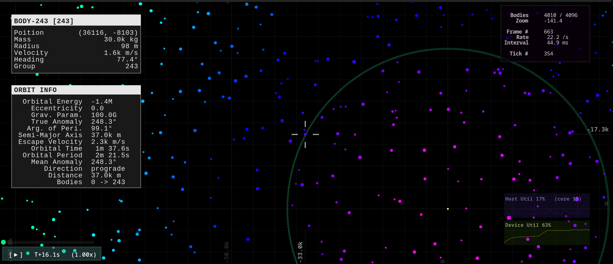
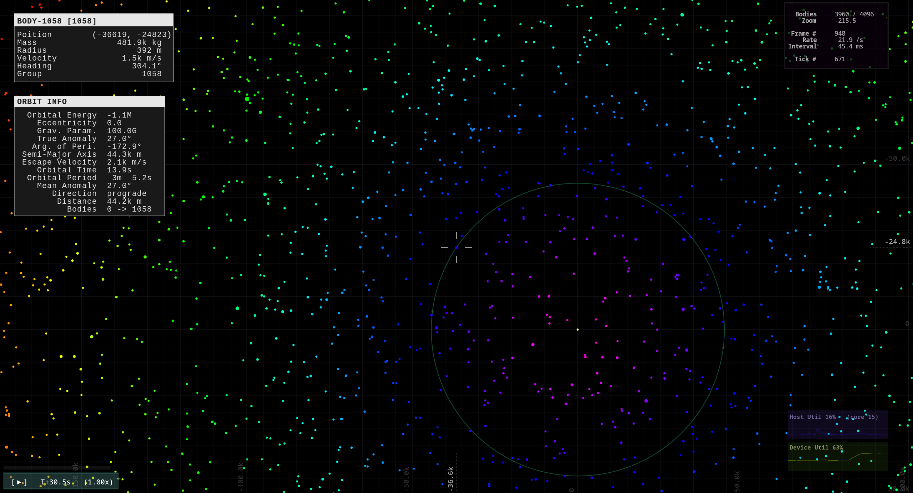
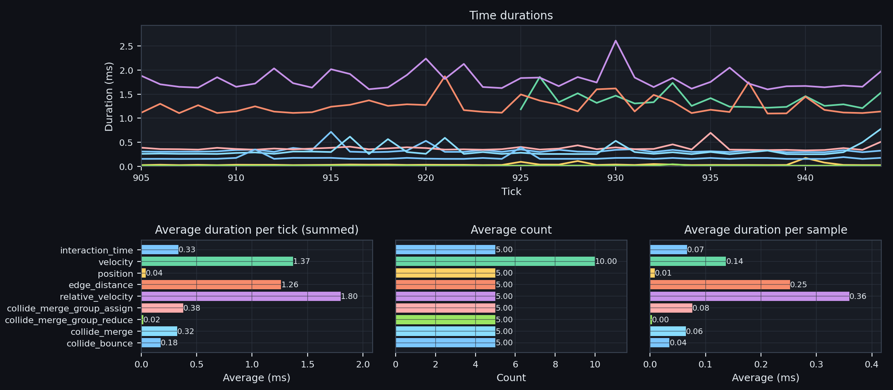

# Orbital Engineer

An N-body orbital engine that implements a Leapfrog KDK integrator. Supports body merging or collision bouncing.

## Theory of Operation

Fundamentally, the engine is split into a pipeline of several OpenCL kernels. The controller is executed on the host, and is responsible for initialization and kernel dispatching. The simulation is performed tick-by-tick, using [leapfrog KDK integration](https://en.wikipedia.org/wiki/Leapfrog_integration) in order to continually compute orbital state vectors for velocity and position.

### Clock Tick

The tick receives the amount of real time that has passed since the last tick. If the dt is greater than the default `dt_base` (set by config option `DEFAULT_DT_BASE`), it will split the operation into several time steps (each using the value of `dt_base`).

### Time Step

Each time step is broken down into three phases:

 1. **Swept Detection** - Compute the time-of-impact for each pair of bodies and track the minimum dt. If the minimum dt is smaller than the base dt for the tick, it is used as the input dt for future steps.
    - By ensuring the dt is never larger than the earliest collision, the engine avoids having a body overlap or 'tunnel' through another body.
    - Two bodies are considered to be in-contact when their edge-to-edge distance is less than the config value `EPS_DIST`.

 2. **Leapfrog KDK** - Integrate position and velocity via three steps:

    |   | step       | dt input       | updates vector    |
    | - | ---------- | -------------- | ----------------- |
    | 1 | `KICK`     | $\frac{dt}{2}$ | velocity          |
    | 2 | `DRIFT`    | $dt$           | position          |
    | 3 | `KICK`     | $\frac{dt}{2}$ | velocity          |

    During kick operations, position vector is read-only.
    And during drift operations, velocity vector is read-only.
    The first `KICK` and `DRIFT` are performed here, and the final `KICK` is performed after the collision detection step.

 3. **Collision Detection** - Determine which bodies are touching, and apply collision operations. Based on the per-body feature flags, one of the following strategies will be enacted.

    - **_None_** : Bodies pass through each-other. In order to avoid asymptotes, overlapping bodies do not continue to impart force until they are no longer overlapping. This is the default strategy for bodies that do not have a `MERGE` or `BOUNCE` flag.
    - **_Merge_** : Bodies are combined. Their velocities and positions are computed based on their center-of-mass.
    - **_Bounce_** : Bodies deflect off of eachother. The strength is controlled by the [coefficient of restitution](https://en.wikipedia.org/wiki/Coefficient_of_restitution). Set via the config option, `COEF_OF_RESTITUTION`.

## Elastic Collisions

**Related kernel**: [`engine/bounce/*`](/src/orbitalengineer/engine/bounce/)

### Coefficient of Restitution

- The coefficient of restitution (denoted as $e$ below), is a value between `0` and `1` that indicates how elastic the collision will be.
- A value of `1` will make the collision fully repulsive (no energy loss), whereas a value of `0` will be attenuated (full energy loss) and "stick" together.
- More information: [Coefficient of Restituion](https://en.wikipedia.org/wiki/Coefficient_of_restitution)
- The default value is defined in the config via the field `COEF_OF_RESTITUTION`.

### Algorithm

These steps are ran for each colliding pair $(i, j)$.

1. Normalize the difference in position:

$$
r_{norm} = |r_j - r_i|
$$

2. Find the relative speed along normal:

$$
v_{nrel} = {Re}((v_i - v_j) \cdot \overline{r_{norm}})
$$

3. Get the scalar impulse magnitude

$$
\frac{1.0 + (e \cdot v_{nrel})}{
   \frac{1}{M_i} + \frac{1}{M_j}
}
$$

4. Apply the final impulse

$$
V_i = V_i + \frac{r_{norm} \cdot \text{scalar impulse}}{M_i}
$$

## Coalescing (e.g. "merging")

### Algorithm for Coalescence

1. Identify collision groups where coalescence is enabled (in this case, this is handled by the flags vector, where `i` and `j` must have the bits `MERGE_AS_PRIMARY` and `MERGE_AS_SECONDARY`)
2. Compute the total momentum of the group

$$
\vec{p}_{\text{tot}} = \sum_{i=0}^{N} m_i \vec{v}_i
$$

3. Compute the total mass of the group

$$
M = \sum_{i=0}^{N} m_i
$$

4. Apply those values to determine CoM velocity and CoM position

$$
   \vec{v}_{\text{cm}} = \frac{\vec{p}_{\text{tot}}}{M} = \frac{\sum_{i=0}^{N} m_i \vec{v}_i}{\sum_{i=0}^{N} m_i}
$$

   Where,

   - $\vec{v}_{\text{cm}}$ is the center-of-mass velocity
   - $\vec{p}_{\text{tot}}$ is the sum total of momentum
   - $M$ is the sum total of mass

$$
   \vec{r}_{\text{cm}} = \frac{\sum_{i=0}^{N} m_i \vec{r}_i}{\sum_{i=0}^{N} m_i}
$$

   Where,

   - $\vec{r}_{\text{cm}}$ is the center-of-mass position

## Performance

Given the following criteria, a reasonable number between 5000-8000 individual bodies can be simulated.

- **Hardware:** AMD Radeon 890M
- **Integration**: `EPS_TIME=1e-3`, `DT_BASE=1/15`
  - The tick controller starts with `DT_BASE`, but the `dt` is _adaptive_. After several ticks, will start to fall into place, between `DT_MIN` and `DT_MAX`, that allows for the highest performance.
- **Elastic Collisions**: Enabled, restitution coefficient `0.98`
- **Coalescence**: disabled (no "merging")
- **Scenario**: 5000-8000 bodies, all configured as secondary, orbiting a central ultra-massive body
- **Performance**: 1-1 wall-time to sim-time. 90% utilization on device (GPU). 20% utilization on host (CPU). No visible bottlenecks in any "hot path" code.

## Apps

### Orbital Engineer Server

The core app that manages the n-body engine. It is responsible for:

- Taking in commands via a socket connection from client apps
- Dispatching ticks/steps to the kernels (either OpenCL or NumPy)
- Syncing orbital state vectors from GPU memory to shared memory
- Tracking & writing kernel metrics to an IPC socket

It will not do anything "on its own" and needs a client to direct it.

### User Interface Client App

Companion app to the server. It builds scenarios, sends commands, and constructs the display based on the orbital state vectors within shared memory.

### App Interactions

    ┏━━━━━━━━━┓     ╭───────────╮                        ╭───────╮
    ┃         ┃     │           ├──── OpenCL kernels ────│  GPU  │
    ┃ SERVER  ┃     │ ORBITAL   │                        ╰───────╯
    ┃         ┃     │ ENGINEER  │
    ┃         ┃     │ (library) │                        ╭───────╮
    ┃         ┃┄┄┄┄┄│           ├──── NumPy kernels ─────│  CPU  │
    ┃         ┃     ╰───────────╯                        ╰───────╯
    ┃         ┃
    ┃         ┃
    ┃         ┃                                  ╭───────────────╮
    ┃         ┃──── write state vectors ───────>>│               │
    ┗━━━━━━━━━┛                                  │ SHARED MEMORY │
         │                                       │               │
         │                                       │ - position    │
     IPC socket                                  │ - velocity    │
     connection                                  │ - mass        │
         │                                       │ - radius      │
         │                                       │ - flags       │
    ┏━━━━━━━━━┓                                  │ - force (N,N) │
    ┃         ┃<<─── read state vectors ─────────│               │
    ┃   GUI   ┃                                  ╰───────────────╯
    ┃         ┃
    ┗━━━━━━━━━┛

## Analyzing Metrics

There's a companion app in `src/ui_metrics` that will display kernel runtime durations.

It can be started via:

    ./.venv/bin/python src/ui_metrics/metrics_app.py

Metrics are enabled via:

   orbitalengineer.engine.config.EMIT_METRICS

When set to `True` (default), pyopencl will enable profiling (which may slightly affect kernel speed), and the orbital-engine will emit the kernel metrics to the socket specified  by `METRIC_SOCKET_PATH`.

## IPC Message Transport Protocol

The IPC communication between client and the engine is governed by a simple protocol consisting of a binary header and a JSON payload. Each payload follows a strict schema.

The full reference is outlined in thi document:

- [Reference](/docs/transport-protocol.md)

## Development

 1. Install system-level OpenCL requirements
    - For AMD GPUs: `sudo pacman -Syu rocm-opencl-runtime`
 2. Set up the virtualenv: `make venv`
 3. Install the engine: `pip install -e .`
